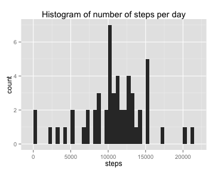
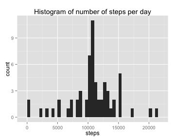

## Loading and preprocessing the data

```r
# Set working directory and unzip file, overwrite old one
setwd("~/Documents/Coursera Data Science/Reproducible research/RepData_Peerassessment1")
unzip("activity.zip", overwrite=TRUE)

# read data in dataframe, remove NA values
stepData <- read.csv("activity.csv", stringsAsFactors=FALSE)
stepDataClean <- stepData[!is.na(stepData$steps), ]
naData = stepData[is.na(stepData$steps), ]
```

## What is mean total number of steps taken per day?

```r
library(ggplot2)
qplot(steps, data = stepData, na.rm=TRUE, binwidth=20, main="Histogram of number of steps per day")
```



```r
meanSteps = mean(stepData$steps, na.rm=TRUE)
medianSteps = median(stepData$steps, na.rm=TRUE)
```
The mean total number of steps per day is 37.3826, while the median total number of steps per day is 0.

## What is the average daily activity pattern?

```r
activity <- aggregate(steps~interval, data=stepData, FUN=mean, na.rm=TRUE)
ggplot(data=activity, aes(x=interval, y=steps)) + 
    geom_line() + 
    ggtitle("Average number of steps per time interval")
```


```r
maxInterval <- activity[which.max(activity$steps), 1]
```
The interval with the highest number of steps, averaged over all days in the dataset, is 835.

## Imputing missing values

```r
library(dplyr)
sumNA <- dim(naData)[1]
replaceData <- select(merge(select(naData,date:interval), activity), steps, date, interval)
stepDataNew <- arrange(rbind(replaceData, stepDataClean), date, interval)
```
The number of missing values is 2304. To replace these values, the average activity in each time interval will be substituted. To this end, the rows with NA values are separated from the rest of the dataset, the column with steps data is removed, and the remaining data is joined with the activity data frame by interval. The resulting set is combined with the original data set and reordered.

```r
qplot(steps, data = stepData, na.rm=TRUE, binwidth=20, main="Histogram of number of steps per day")
```



```r
meanStepsNew <- mean(stepDataNew$steps, na.rm=TRUE)
medianStepsNew <- median(stepDataNew$steps, na.rm=TRUE)
```
For the new data set, the mean total number of steps per day is 37.3826, while the median total number of steps per day is 0. These values are the same as for the original data set. The histogram also does not show a different trend, although the total count has gone up because the missing data has been replaced.

## Are there differences in activity patterns between weekdays and weekends?

```r
Sys.setlocale("LC_TIME", "en_US")
```

```
## [1] "en_US"
```

```r
weekOrWeekend <- function(date) {
    if (weekdays(as.Date(date)) == "Saturday" || weekdays(as.Date(date)) == "Sunday") {
        daytype <- "weekend"
    } else {
        daytype <- "weekday"
    }
}
stepDataNew <- mutate(stepDataNew, daytype = sapply(date, weekOrWeekend))
activityNew <- aggregate(steps~interval+daytype, data=stepDataNew, FUN=mean, na.rm=TRUE)

ggplot(activityNew, aes(x=interval, y=steps)) + 
    geom_line() + 
    facet_wrap( ~ daytype, ncol=1) +
    ggtitle("Average number of steps per time interval")
```


From the figure above, it is clear that there is a difference is activity patterns for weekdays and the weekend.
